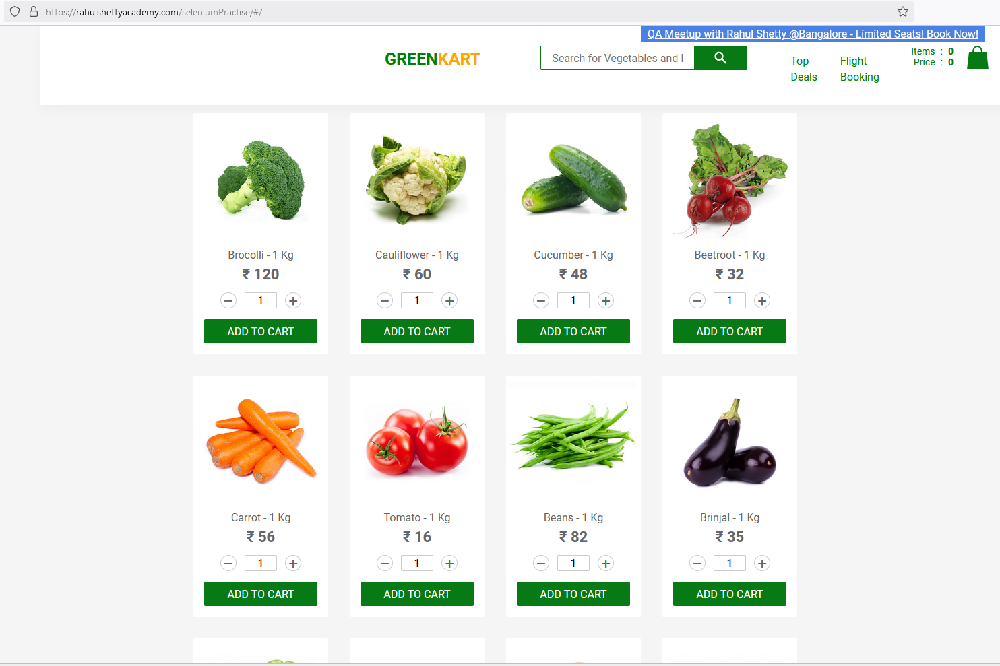

# Green Kart Ecommerce Website - Manual Testing 🚀

Welcome to the **Green Kart Ecommerce Website** testing repository! 🌱🛒
This project is part of my manual testing portfolio and showcases my skills in testing eCommerce websites. 

Green Kart is one of the test websites provided in **Rahul Shetty's Software Testing** course, so it is designed with intentional bugs to help testers practice finding and reporting issues. This repository contains various testing artifacts to give you a comprehensive view of the testing process.

## Website Overview 🌍

Green Kart is an online eCommerce platform that sells organic food products. The website allows customers to browse, search, and purchase items, and offers various features such as filtering products, adding them to the shopping cart, and checking out.

Here is a snapshot of the website's homepage:

## Purpose of Testing 🧪

This repository contains detailed documentation and test artifacts to ensure that Green Kart is thoroughly tested from a **manual testing** perspective. The goal is to identify bugs, usability issues, and areas of improvement for a better user experience.

### Testing Areas Include:
- **Functionality Testing**: Ensuring core features work as expected.
- **Usability Testing**: Assessing how easy and user-friendly the site is.

## Test Documentation 📑

- **Test Plan**: A comprehensive test strategy that outlines the approach, scope, and objectives for testing the Green Kart website. [View Test Plan](./Test-Plan.md)
- **Test Scenarios**: Detailed test scenarios covering all key functionality of the website. [View Test Scenarios](./Test-Scenarios.md)
- **Test Cases**: An Excel file containing specific test cases for functional testing. [Download Test Cases](./Test-Cases.xlsx)
  
The test cases were designed to ensure comprehensive coverage across all areas of the website.

## Testing Tools 🔧

The testing was conducted using **manual testing** techniques, and some tools and techniques used include:
- **Exploratory Testing**: Exploring the application and identifying issues through spontaneous test scenarios.
- **Checklists**: A standardized checklist to ensure critical test areas are covered.
- **Bug Reporting**: Following a structured format to report identified bugs.

## Testing Highlights ⚡

- **Exploratory Testing**: A significant portion of the testing was exploratory, where the website was used in various ways to identify unanticipated bugs. 
- **Critical Bugs Found**: Several usability and functionality bugs were found, demonstrating the importance of thorough testing in the eCommerce domain.

## Future Improvements 💡

Some areas for improvement and enhancement include:
- **UI Consistency**: Refining some UI elements for better visual appeal.
- **Performance Optimization**: Exploring load times and overall performance improvements.
